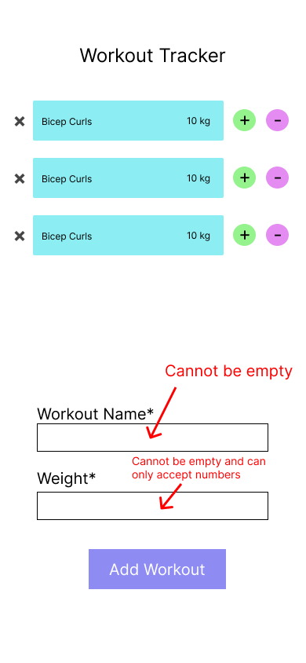
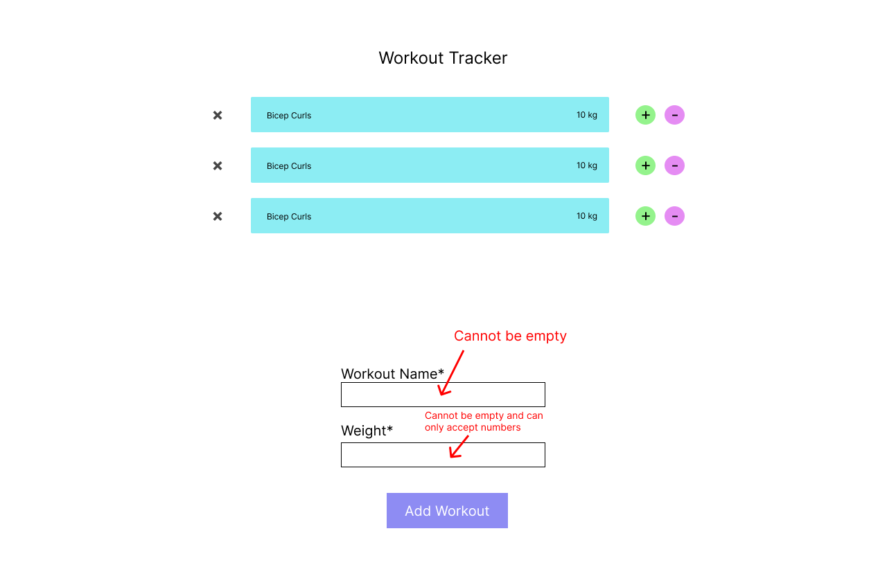

# Welcome to Appify

> Info ℹ️ \
> This was created via Create React App

## What is Appify?

There are plenty of basic applications that we use in everyday life. The Goal of Appify is to makes mini-apps that help take care of those tasks.

### Basic Apps in Appify

#### Button Counter

- [ ] Button with Counter Text
- [ ] Everything should be centered in the middle of the page
- [ ] Every 10 on the counter should change the color of the text

#### Random Picture Generator

- [ ] Button and Picture generated
- [ ] Picture should be generated from this [picture api](https://picsum.photos)
- [ ] Picture and button should be centered on the page
- [ ] Error handling should produce text "Picture Not Found"
- [ ] Should be able to pick 1-5 pictures to generate

#### Workout Tracker

- [ ] List that contains information of **weight** and **workout**
- [ ] Should be able to add items to the list
- [ ] Should be able to delete items from list
- [ ] Should be able to increment item in the list by 5
- [ ] Should be able to toggle between kg/lb on click
- [ ] Bonus: Make it persistent on refresh

Example:

How the App Should Look on Phone

How the App Should Look on Desktop

